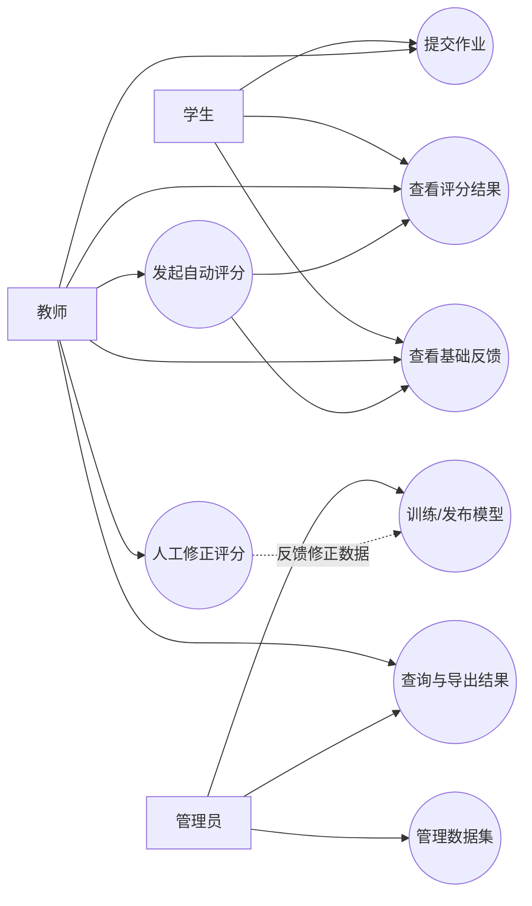
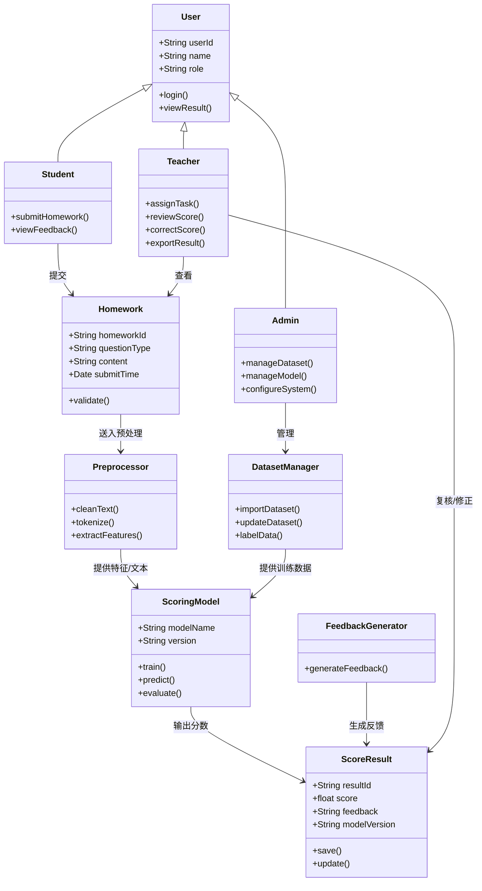
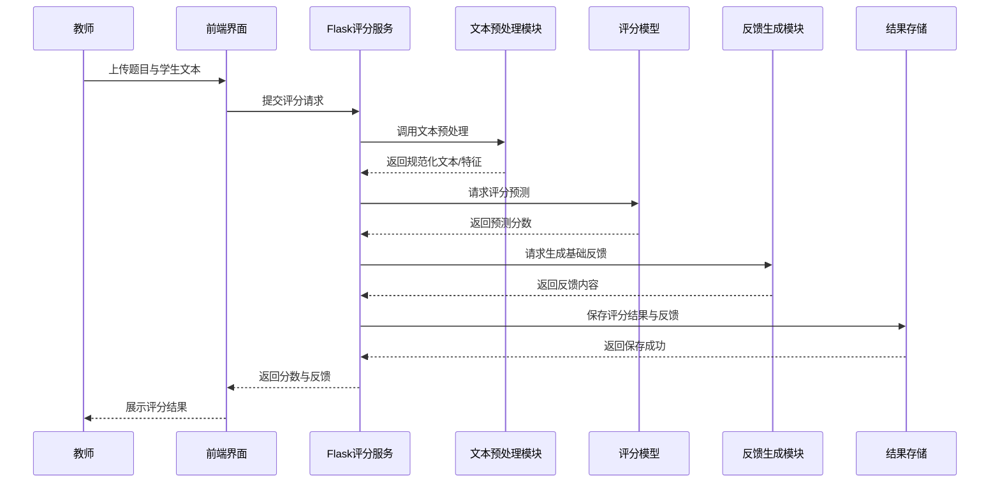

# 基于课题内容的需求分析报告

## 1. 课题理解

本课题面向纯文本作业自动评分场景，主要处理作文、简答题、论述题等非结构化文本答案。系统基于预训练语言模型对学生文本进行语义理解，输出作业分数，并生成基础反馈，从而降低教师重复阅卷成本，提高评分效率与评分一致性。

从课题描述可以提炼出三个核心目标：

1. 实现文本作业的自动评分。
2. 为评分结果提供可解释的基础反馈。
3. 提供可部署、可交互的评分服务与结果展示界面。

## 2. 业务目标

### 2.1 建设目标

1. 建立面向文本作业的自动评分流程，覆盖数据预处理、模型训练、评分预测和结果展示。
2. 支持教师上传作业文本并获得自动评分结果。
3. 支持对评分结果生成简要评语或得分依据提示。
4. 支持模型训练与更新，逐步提高评分准确率与泛化能力。
5. 支持通过 Web 界面或 API 形式进行部署和调用。

### 2.2 适用场景

1. 作文自动评分。
2. 简答题自动评分。
3. 论述题自动评分。
4. 学术文本或摘要类评分扩展场景。

## 3. 参与者分析

### 3.1 教师

1. 上传题目与学生答案。
2. 发起自动评分。
3. 查看分数、反馈和文本分析结果。
4. 必要时人工修正评分结果。

### 3.2 学生

1. 提交文本作业。
2. 查看系统给出的得分与基础反馈。

### 3.3 管理员

1. 管理数据集、模型版本与系统配置。
2. 维护评分规则与题目类型。
3. 监控系统运行状态。

### 3.4 模型服务

模型服务作为系统内部执行角色，负责完成文本预处理、特征提取、评分预测与反馈生成。

## 4. 业务流程分析

系统的典型业务流程如下：

1. 教师或学生提交文本作业。
2. 系统对文本进行清洗、分词、标准化等预处理。
3. 评分模型读取处理后的文本并完成语义表示学习。
4. 评分引擎输出预测分数。
5. 反馈生成模块结合文本内容与评分结果生成基础反馈。
6. 前端界面展示分数、评语和必要的文本分析信息。
7. 教师可对评分结果进行复核与修正，修正数据可回流用于模型优化。

## 5. 功能需求分析

### 5.1 作业提交管理

1. 系统应支持录入或上传纯文本作业内容。
2. 系统应支持按题目类型区分作文、简答题、论述题。
3. 系统应保存学生、题目、提交时间、作业文本等基本信息。

### 5.2 文本预处理

1. 系统应支持对文本进行清洗，去除无效符号与噪声内容。
2. 系统应支持分词、词性标注、实体识别等基础处理。
3. 系统应支持不同题型对应的预处理策略配置。

### 5.3 自动评分

1. 系统应支持基于预训练模型的文本评分。
2. 系统应支持输出标准化分数或题目对应分值区间内的预测结果。
3. 系统应支持批量评分与单篇评分两种模式。
4. 系统应支持加载不同模型版本以适应不同课程或题型。

### 5.4 反馈生成

1. 系统应基于文本内容和评分结果生成基础反馈。
2. 反馈至少应包括总体评价、优点提示和待改进建议。
3. 系统应支持结合人工标注得分点生成针对性反馈。

### 5.5 结果展示与查询

1. 系统应展示作业得分、反馈内容和必要的文本分析结果。
2. 系统应支持按学生、题目、时间进行评分结果查询。
3. 系统应支持评分结果导出，用于教学统计或留档。

### 5.6 人工复核与模型优化

1. 系统应支持教师对自动评分结果进行人工修正。
2. 系统应记录修正前后分数与修改原因。
3. 系统应支持将人工修正结果纳入后续模型训练数据。

### 5.7 系统管理

1. 系统应支持数据集管理，包括导入、更新与版本记录。
2. 系统应支持模型训练、模型发布和模型版本切换。
3. 系统应支持 API 服务调用与前端可视化界面集成。

## 6. 非功能需求分析

### 6.1 性能需求

1. 单篇文本评分响应时间应控制在可接受范围内，满足课堂或作业场景的基本使用要求。
2. 系统应支持一定规模的批量文本评分。

### 6.2 准确性需求

1. 自动评分结果应与人工评分保持较高一致性。
2. 系统应尽量减少不同文本长度、主题和表达风格带来的评分偏差。

### 6.3 可用性需求

1. 界面应简洁，便于教师快速完成上传、评分与查看结果。
2. 输出结果应具备基本可解释性，避免只给分不反馈。

### 6.4 可维护性需求

1. 模型、数据集和评分规则应支持独立更新。
2. 系统应采用模块化设计，便于后续扩展新题型或新模型。

### 6.5 安全性需求

1. 学生作业文本与评分数据应妥善存储，避免泄露。
2. 系统应具备基本的访问控制与日志记录能力。

## 7. 数据需求分析

### 7.1 输入数据

1. 学生作业文本。
2. 题目信息与题型。
3. 历史人工评分数据。
4. 得分点标注信息或参考答案信息。

### 7.2 输出数据

1. 自动评分分数。
2. 基础反馈文本。
3. 评分记录与统计结果。
4. 模型训练与评估指标。

### 7.3 数据来源

1. ASAP 数据集，用于作文自动评分训练与验证。
2. PeerRead 数据集，用于学术文本评分扩展。
3. 自建数据集，用于适配学校课程场景。

## 8. 可行性分析

### 8.1 技术可行性

课题提供了较明确的技术栈基础。Transformers 可用于构建 BERT、RoBERTa 等文本评分模型，spaCy 可支持文本预处理，Flask-RESTful 可用于后端服务封装，Streamlit 可快速完成前端展示，因此整体技术路线具备较强可行性。

### 8.2 数据可行性

已有公开数据集可用于模型验证和基线构建，自建数据集可用于后续业务适配。但若目标是特定课程评分，仍需补充本地真实教学数据，以提升模型在实际场景中的有效性。

### 8.3 业务可行性

教师评分工作量较大，文本题评分主观性强，因此自动评分系统具有明确应用价值。系统短期可作为辅助评分工具，中长期可逐步发展为人机协同评分平台。

## 9. 用例图

以下用 Mermaid 流程图形式表达系统用例关系。

## 10. 类图

## 11. 顺序图

以下顺序图描述教师发起一次自动评分的典型过程。

